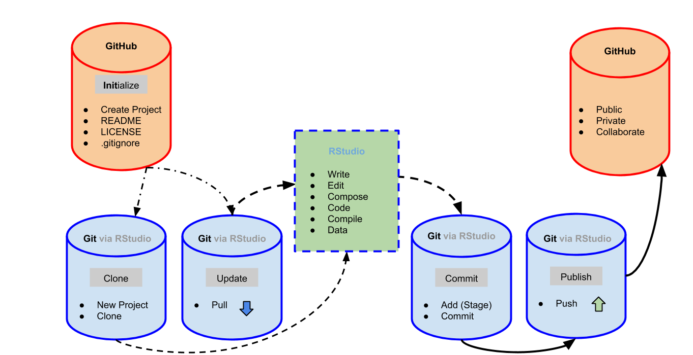
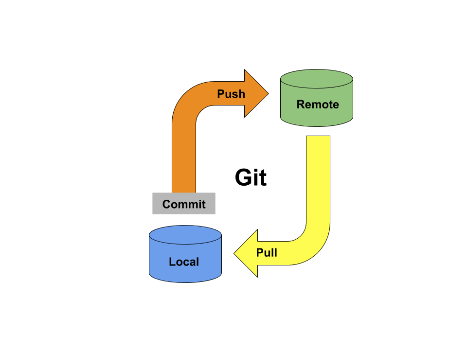
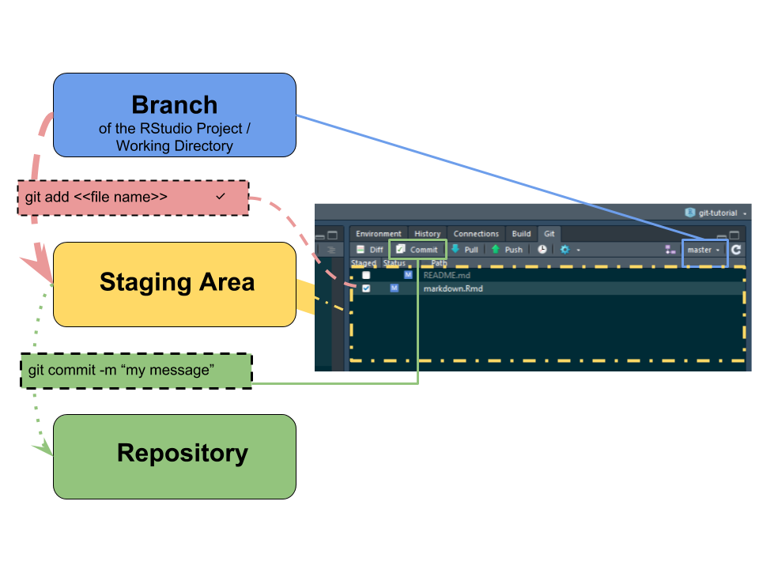
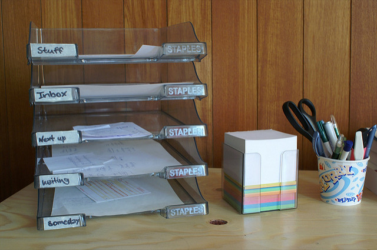
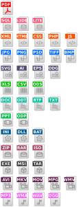

exclude: true

```{r, message=FALSE, warning=FALSE, include=FALSE}
library(tidyverse)
library(DT)
```


---
class: middle, center

Part of the 
### Building Blocks for Reproducibility

&

### [RFun](http://rfun.library.duke.edu) Learning Series


???

This is a presenter comment for the presenter mode

use 'p' to toggle the presenter mode or '?' or 'h' to toggle the help / key-shortcut options


---
class: middle, center

### Goal

# Compose a Reproducible Document

Use Git to manage version control

Clone &#8226; Pull &#8226; Add &#8226; Commit &#8226; Push 

(Branch &#8226; Merge &#8226; Revert &#8226; Fork &#8226; Collaborate)

---
class: middle, center

## Reproducible Research

### Open / Transparent

### Version Control

### Literate Code

### Collaborative


---
class: middle

## Why RStudio?

- **Reproducibility** is a Top Priority

    - Seamless IDE integration between R & Git 
    - [Markdown](https://rmarkdown.rstudio.com/) 

- **Git for Version Control**

    - Git can be a pain to configure but works well in the background
    - Leapfrog beyond the barrier of a painful configuration

- **RStudio orchestrates Git**

    - Alternative GUI Git Clients
    
        - [Sublime's Merge](https://www.sublimemerge.com/)
        - GitKracken (if you have the [GitHub Student](https://education.github.com/pack) Pack)
        - [SourceTree](https://www.sourcetreeapp.com/).  (defaults with [BitBucket](https://bitbucket.org/))

---
class: middle

# Part 2:  Social Coding

- GitHub (especially with Student Pack)
- GitLab or Duke's instance of GitLab  
- Bitbucket.org or GitLab.com 

---
class: middle, center, duke-softblue

# Reproducibility

---
class: middle
Karl Broman's *[initial steps toward reproducible research](http://kbroman.org/steps2rr/)*

- Organize your data and code
- [Everything with a script](http://kbroman.org/steps2rr/pages/scripts.html)
- Automate the process
- Turn scripts into reproducible reports
- Turn repeated code into functions
- Package functions for reuse
- Use version control
- License your software

---
class:  middle

## Broman: Everything with a script

The most basic aspect of **reproducible research** is that **everything you do** (convert data files, clean data, analyze data) should be **accomplished via code.** 

*Pointing and clicking, and copy-paste, are not reproducible.*  


???

Goal:  Compose a Reproducible Document **in RStudio**

---
class: middle, center

Avoid

## Idiosyncratic Critical Steps 

so your processes **are not** reduced to

## Weird Bits of Undocumented Manual Magic

???

For Example...

1. Create Summary **Table in STATA**

2. **Copy** Table to MS **Excel**

3. **Format Table** for readability in Excel

4. Generate **Visualizations** in Excel

5. Integrate Excel Table into **Word > PDF**


---
class: middle, center, duke-softblue

# Version Control


---
class:  middle, center

## Version Control

 
???

RStudio will manage the most commonly used Git commands

---
class:  middle, center




---
class:  middle, center
background-size: contain



---
class: center, middle, duke-softblue

## **Git** is a *Version Control System*

---
class: bottom, right
background-image:  url(images/flickr_RupertsDogBoye_trail.jpg)

 
.small-beige[ Image Credit: [Brandon Rasmussen](https://www.flickr.com/photos/137029081@N02/30943501632/in/photostream/) ]

???

Versioning can be used 

- as a kind of **breadcrumb system** that helps track the **research process/workflow**

- Using version control, one can **easily "roll back"** to an earlier moment in the research workflow.

- Leave a documented 

    - **trail of where you've been**
    - how you got there
    - generated as you go

---
## Repositories

.pull-left[

<figure><figcaption> Image Credit: <a href="https://www.flickr.com/photos/dbloete/274563369">Dennis Reimann</a></figcaption></figure><br>


- Source Code Management

- Track changes in any file set

- Add &#8226; Commit &#8226; Branch &#8226; Merge &#8226; Revert

]

.pull-right[

<figure><figcaption> Image Credit: <a href="https://openclipart.org/detail/192197/file-extension-icons">OpenClipart.org</a></figcaption></figure><br>


]

???

### Source Code Mangement
By this I simply mean **version control on a personal level**.  Once can "branch" stages of research and merge successful operations.  In this way it becomes easier to keep track of the process and the progress.

### Tracking changes in **any file set**

**Git** can be used to **track any files**. 

---
class: duke-softblue, middle, center

## Markdown

---


class: bottom
background-image: url(images/rmarkdown.png)

.small-txt[
  Image Credit: [RStudio](http://rmarkdown.rstudio.com/)
]

???

R Markdown -- when combined with various R packages -- makes R a flexible report generation system.  Thus R Notebooks become "literate code" where reports are an outcome of analysis.  If analysis changes at "run-time" reports can change as integrated parts of the whole.  

Notably:  **You Don't have to be a coder** to benefit from Version Control and R Markdown.  The two method/features can be used to compose all of your reporting needs, including MS Word, PDF, LaTex, WebPages, WebSites, Slides, e-books, etc.

I want to emphasize that *R* and *Git* are ideal for *reproducible research*.  However, the added factor of **R Markdown** -- when combined with various R packages -- makes R a flexible report generation system, arguably more *open* and *reproducible* than other proprietary collaborations systems.

---
class: middle
.pull-left[

&nbsp; 

```
# Heading

## Sub-heading

### Another deeper heading
 
Text attributes 
 *italic*, **bold**, `monospace`.

A [link](http://google.com).

Bullet list:

- apples  
- oranges  
- pears  

Numbered list:

1. apples
2. oranges
3. pears
```
]

.pull-right[

&nbsp;

## Sub-heading

### Another deeper heading

*italicized*, **bold**, `monospace`

A [link](http://google.com)

Bullet list:
- applies
- oranges
- pears

Numbered list:
1. apples
2. oranges
3. pears

]


---
class: middle, center

## Hands-on

[Excercise](../handson.html)

---
## Thank You For Attending

.pull-left[
### I am ...

- **John Little**
- https://johnlittle.info
- https://github.com/libjohn

#### Schedule Me

- [http:&#47;&#47;v.gd&#47;littleconsult](http://duke.libcal.com/appointment/2695)

### With...

- Sophia Lafferty-Hess
- Jen Darragh
- [library.duke.edu/data/../staff/](https://library.duke.edu/data/about/staff/)

]

.pull-right[
### We are...
- Data & Visualization Services
- [library.duke.edu/**data**](http://library.duke.edu/data)
- The /Edge, Bostock (1st Floor)

#### Walk-in Hours
- [Schedule](http://library.duke.edu/data/about/schedule)

#### Our Workshops
- [Rfun](http://rfun.library.duke.edu/)
- [Current Workshops](http://library.duke.edu/data/news)
- [Past Workshops](http://library.duke.edu/data/news/past-workshops)

#### Contact Us
- askData@Duke.edu
]

---
class: center, middle
## Shareable 

Data, presentation, and handouts 

<span class="cc">
<!-- Key: a: SA, b: BY, c: CC Circle, d: ND, n: NC, m: Sampling, s: Share, r: Remix, C: CC Full Logo -->
C bn
</span>


[CC BY-NC license](https://creativecommons.org/licenses/by-nc/4.0/)